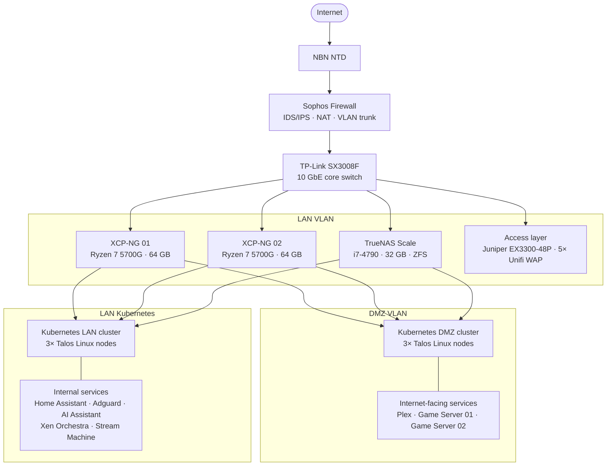

# homelab

A self-hosted infrastructure built for hands-on learning in network security, segmentation, and systems administration. Everything runs on custom built servers in a 27U rack in my house.

**[→ Interactive rack diagram](https://kylindrias.github.io/Home-Lab)**

---

## Overview

The lab is designed for self hosted services as well as education.

---

## Security architecture

### Network segmentation

Traffic is segmented into two VLANs enforced at the Sophos firewall:

| VLAN | Purpose | Internet access | LAN access |
|------|---------|----------------|------------|
| LAN | Internal services, management, storage | Outbound only | Full |
| DMZ | Internet-facing services | Inbound + outbound | Denied |

### Dual Kubernetes clusters

Rather than using namespaces or network policies alone to separate workloads, internet-facing and internal services run on entirely separate Kubernetes clusters with separate Talos nodes — one cluster per VLAN. This provides stronger isolation guarantees than a shared control plane.

| Cluster | VLAN | Nodes | Workloads |
|---------|------|-------|-----------|
| LAN cluster | LAN | Talos nodes 01–03 | Home Assistant, Adguard, AI Assistant, Xen Orchestra |
| DMZ cluster | DMZ | Talos nodes 04–06 | Plex, Game Server 01, Game Server 02 |

Each set of Talos nodes is spread across all three physical hosts (XCP-NG 01, XCP-NG 02, TrueNAS Scale) so a single host failure does not take down either cluster.

### Talos Linux

Kubernetes nodes run [Talos Linux](https://www.talos.dev/) — an immutable, API-driven OS with no SSH access and no shell. The attack surface is minimal by design: the OS cannot be modified at runtime, and all management is performed via `talosctl` over mTLS.

### DNS filtering

Redundant [AdGuard Home](https://adguard.com/en/adguard-home/overview.html) instances provide network-wide DNS filtering and ad blocking for LAN clients, with the Sophos firewall configured to intercept and redirect all DNS queries to prevent bypassing.

---

## Physical infrastructure

| Device | Role | U |
|--------|------|---|
| Patch panel | Cable management | 1U |
| Juniper EX3300-48P | PoE access switch | 1U |
| NBN NTD | ISP handoff | 1U |
| TP-Link SX3008F | 10 GbE core switch | 1U |
| Sophos Firewall | Firewall / IDS / IPS | 2U |
| Unifi NVR | IP camera management | 1U |
| *(blank)* | | 2U |
| XCP-NG 01 | Hypervisor | 4U |
| XCP-NG 02 | Hypervisor | 4U |
| TrueNAS Scale | NAS + hypervisor | 4U |
| *(blank)* | | 4U |
| Cyberpower UPS | Power protection | 2U |

---

## Storage

TrueNAS Scale manages all persistent storage via ZFS — providing checksumming, compression, snapshots, and replication. Kubernetes persistent volumes are provisioned via [Longhorn](https://longhorn.io/) backed by the ZFS pool over NFS/iSCSI.

---

## Tech stack

`XCP-NG` `Talos Linux` `Kubernetes` `Longhorn` `TrueNAS Scale` `ZFS` `Sophos SFOS` `Traefik` `cert-manager` `AdGuard Home` `Home Assistant` `Unifi`
